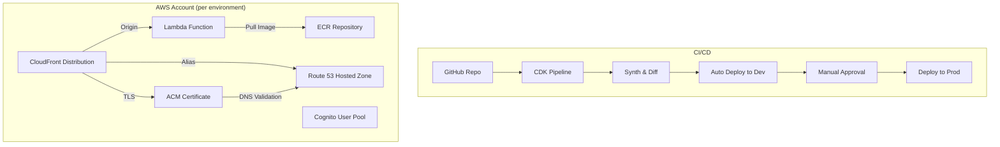

# Design Document: Music Portfolio Infrastructure

## Overview

This design describes the AWS CDK infrastructure for a music portfolio site. The project provisions cloud resources using TypeScript CDK constructs, supporting two environments (dev/prod) and multi-account deployment. The infrastructure serves a containerized application via Lambda behind CloudFront, with DNS, TLS, and authentication managed through Route 53, ACM, and Cognito respectively.

The CDK app is structured as a single deployable stack parameterized by environment configuration. A CI/CD pipeline (CDK Pipelines) automates deployment to dev on push and gates prod behind manual approval.

## Architecture



### Deployment Flow

1. Developer pushes to main branch
2. Pipeline triggers: synth → diff → deploy to dev (automatic)
3. Prod deployment requires manual approval in the pipeline
4. Stack is parameterized by environment config (account, region, domain, resource sizing)

### Multi-Account Strategy

Environment configuration is externalized into a config structure passed at synth time. No account-specific values are hardcoded. The same stack code deploys to any target account by swapping config.

## Components and Interfaces

### CDK App Entry Point (`bin/app.ts`)

- Instantiates the CDK App
- Reads environment configuration (from `cdk.json` context or environment variables)
- Creates the pipeline stack or individual environment stacks

### Environment Configuration (`lib/config.ts`)

```typescript
interface EnvironmentConfig {
  envName: 'dev' | 'prod';
  account: string;
  region: string;
  domainName: string;
  subDomain?: string;
  lambdaMemorySize: number;
  lambdaTimeout: number;
}
```

### Infrastructure Stack (`lib/infra-stack.ts`)

Single stack containing all resources, parameterized by `EnvironmentConfig`:

| Resource | Construct | Key Configuration |
|----------|-----------|-------------------|
| ECR Repository | `ecr.Repository` | Lifecycle: retain 10 images, scan on push |
| Lambda Function | `lambda.DockerImageFunction` | Image from ECR, configurable memory/timeout |
| CloudFront | `cloudfront.Distribution` | Lambda origin, ACM cert, custom domain |
| Route 53 Zone | `route53.HostedZone` | Portfolio domain |
| DNS Record | `route53.ARecord` | Alias to CloudFront |
| ACM Certificate | `acm.DnsValidatedCertificate` | us-east-1, DNS validation via Route 53 |
| Cognito User Pool | `cognito.UserPool` | Password policy (min 8 chars), app client |

### Pipeline Stack (`lib/pipeline-stack.ts`)

- Uses CDK Pipelines (`pipelines.CodePipeline`)
- Source: GitHub connection
- Synth step: `npx cdk synth`
- Dev stage: auto-deploy
- Prod stage: manual approval gate

### Cross-Stack References

The ACM certificate must be in `us-east-1` for CloudFront. If the main stack deploys to another region, a cross-region reference or a separate certificate stack is needed. The design uses `DnsValidatedCertificate` which handles cross-region provisioning internally when the stack is in a different region, or alternatively provisions the cert in a dedicated us-east-1 stack and passes the ARN.

**Decision:** Use `acm.Certificate` with DNS validation in a cross-region stack pattern if the primary region is not us-east-1. For simplicity, if the primary deployment region is us-east-1, a single stack suffices.

## Data Models

### Environment Configuration

```typescript
interface EnvironmentConfig {
  envName: 'dev' | 'prod';
  account: string;
  region: string;
  domainName: string;        // e.g., "jameswilliams.music"
  subDomain?: string;        // e.g., "dev" for dev environment
  lambdaMemorySize: number;  // MB, e.g., 512 for dev, 1024 for prod
  lambdaTimeout: number;     // seconds, e.g., 30
}
```

### Pipeline Configuration

```typescript
interface PipelineConfig {
  repoOwner: string;
  repoName: string;
  branch: string;
  connectionArn: string;     // CodeStar connection ARN
  devConfig: EnvironmentConfig;
  prodConfig: EnvironmentConfig;
}
```

### Resource Naming Convention

Resources are named with environment prefix to avoid collisions:

- ECR: `{envName}-music-portfolio`
- Lambda: `{envName}-music-portfolio-fn`
- CloudFront: identified by distribution ID (no custom name)
- Route 53 Zone: `{domainName}`
- Cognito: `{envName}-music-portfolio-users`

### CDK Context (`cdk.json`)

```json
{
  "app": "npx ts-node bin/app.ts",
  "context": {
    "dev": {
      "account": "123456789012",
      "region": "us-east-1",
      "domainName": "example.com",
      "subDomain": "dev",
      "lambdaMemorySize": 512,
      "lambdaTimeout": 30
    },
    "prod": {
      "account": "987654321098",
      "region": "us-east-1",
      "domainName": "example.com",
      "lambdaMemorySize": 1024,
      "lambdaTimeout": 60
    }
  }
}
```


## Correctness Properties

*A property is a characteristic or behavior that should hold true across all valid executions of a system — essentially, a formal statement about what the system should do. Properties serve as the bridge between human-readable specifications and machine-verifiable correctness guarantees.*

### Property 1: Environment-specific resource naming

*For any* valid environment configuration (dev or prod), all named resources in the synthesized CloudFormation template should contain the environment name as a prefix or identifier, ensuring no naming collisions between environments.

**Validates: Requirements 1.4, 1.5**

### Property 2: Account and region externalization

*For any* valid account ID and region pair provided in the configuration, the synthesized CloudFormation template should reference only those values and contain no hardcoded account-specific identifiers in resource definitions.

**Validates: Requirements 1.3, 9.1, 9.2**

### Property 3: Lambda configuration reflects environment

*For any* environment configuration with specified memory size and timeout values, the synthesized Lambda function resource should have its MemorySize and Timeout properties set to exactly those configured values.

**Validates: Requirements 3.2**

### Property 4: DNS record uses environment-appropriate domain

*For any* dev environment configuration with a subdomain specified, the DNS record name should include that subdomain prefix. *For any* prod environment configuration, the DNS record should use the apex domain or www subdomain.

**Validates: Requirements 5.3, 5.4**

## Error Handling

### CDK Synthesis Errors

| Error Scenario | Handling |
|----------------|----------|
| Missing environment config | CDK app fails at synth with descriptive error message indicating which config values are missing |
| Invalid account/region | AWS SDK validation fails during synth; error propagated to pipeline |
| Cross-region certificate failure | Stack creation fails with CloudFormation error; pipeline halts |
| ECR image not found | Lambda creation succeeds but invocation fails; handled at application layer |

### Pipeline Error Handling

- **Synth failure**: Pipeline halts, no deployment occurs (CDK Pipelines default behavior)
- **Diff shows destructive changes**: Visible in pipeline output; manual approval gate for prod provides human review
- **Deployment rollback**: CloudFormation automatic rollback on stack update failure

### Runtime Considerations

- Lambda cold starts: Mitigated by appropriate memory sizing per environment
- CloudFront cache invalidation: Not automated in this stack; handled by deployment scripts in the application repo
- DNS propagation: TTL set appropriately; no infrastructure-level error handling needed

## Testing Strategy

### Unit Tests (CDK Assertions)

Use `aws-cdk-lib/assertions` to verify synthesized templates:

- **Resource existence**: Verify each expected resource type exists in the template (ECR, Lambda, CloudFront, Route 53, ACM, Cognito)
- **Specific configurations**: Verify ECR lifecycle policy retains 10 images, scan on push enabled, Cognito password policy min length 8
- **Pipeline structure**: Verify dev stage has no approval, prod stage has manual approval
- **Certificate region**: Verify ACM certificate targets us-east-1

### Property-Based Tests (fast-check)

Use `fast-check` library for property-based testing of CDK stack parameterization:

- **Minimum 100 iterations** per property test
- Each test tagged with: `Feature: music-portfolio-infra, Property {number}: {property_text}`
- Generate random valid environment configurations and verify synthesized output satisfies properties

**Property test approach:**
1. Generate arbitrary valid `EnvironmentConfig` objects (random account IDs, regions, domain names, memory sizes, timeouts)
2. Synthesize the stack with each generated config
3. Assert the correctness properties hold on the resulting CloudFormation template

### Test Organization

```
test/
├── unit/
│   ├── ecr.test.ts          # ECR resource assertions
│   ├── lambda.test.ts       # Lambda resource assertions
│   ├── cloudfront.test.ts   # CloudFront assertions
│   ├── dns.test.ts          # Route 53 + ACM assertions
│   ├── cognito.test.ts      # Cognito assertions
│   └── pipeline.test.ts     # Pipeline structure assertions
└── property/
    ├── naming.property.ts   # Property 1: env-specific naming
    ├── account.property.ts  # Property 2: account externalization
    ├── lambda.property.ts   # Property 3: Lambda config
    └── dns.property.ts      # Property 4: DNS domain
```

### Test Tooling

- **Framework**: Jest (standard for CDK projects)
- **CDK Assertions**: `aws-cdk-lib/assertions` (`Template.fromStack()`, `hasResourceProperties()`)
- **Property-based testing**: `fast-check` (generates random inputs, runs 100+ iterations)
- **CI integration**: Tests run as part of pipeline synth step; failures block deployment
