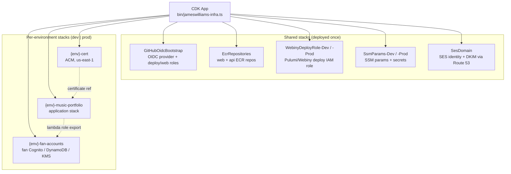
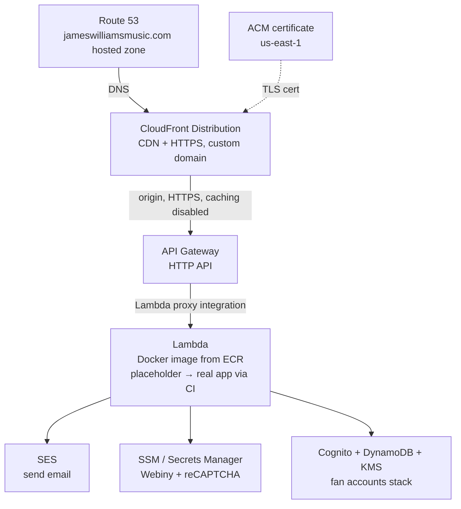
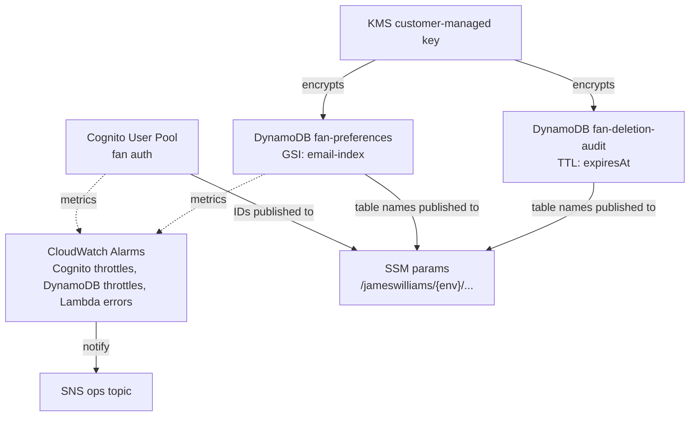

# Music Portfolio Infrastructure

AWS CDK infrastructure for a music portfolio site. This is the **infra** repo in a microservice architecture alongside frontend, api, and webiny repos.

Provisions cloud resources for a containerized application with environment separation (dev/prod) and multi-account deployment support.

## Architecture

The CDK app (`bin/jameswilliams-infra.ts`) synthesizes several independent CloudFormation stacks. Some are shared across environments and deployed once, while the application infrastructure is deployed per-environment (dev/prod) selected via `--context env=`.

### Stack Map



### Application Request Flow (`{env}-music-portfolio`)



### Fan Accounts Stack (`{env}-fan-accounts`)



### Stacks

| Stack | Scope | Purpose |
|-------|-------|---------|
| `GitHubOidcBootstrap` | shared (once) | GitHub OIDC provider + IAM roles: `github-actions-deploy` (Admin, CDK deploys) and `github-actions-jameswilliams-web` (ECR push, Lambda update, SSM/Secrets read, CloudFront invalidation) |
| `EcrRepositories` | shared (once) | ECR repos for `jameswilliams-web` and `jameswilliams-api` (retain, scan on push, 10 most recent) |
| `WebinyDeployRole-Dev` / `-Prod` | shared (once) | Broad IAM deploy role for Webiny CMS (Pulumi) — S3, DynamoDB, Lambda, API Gateway, CloudFront, Cognito, OpenSearch, Step Functions, WAF, etc. |
| `SsmParams-Dev` / `-Prod` | shared (once) | SSM parameters (Webiny API URL, reCAPTCHA site key) + Secrets Manager (Webiny API token, reCAPTCHA secret) |
| `SesDomain` | shared (once) | SES domain identity + DKIM + MAIL FROM for `jameswilliamsmusic.com`, DNS managed via Route 53 |
| `{env}-cert` | per-env | ACM certificate in `us-east-1` for CloudFront (DNS validation) |
| `{env}-music-portfolio` | per-env | Application: ECR, Lambda (Docker), API Gateway HTTP API, CloudFront, Cognito user pool |
| `{env}-fan-accounts` | per-env | Fan auth (Cognito), preferences + deletion-audit DynamoDB tables, KMS key, CloudWatch alarms + SNS, discovery SSM params |

### AWS Services

| Service | Purpose |
|---------|---------|
| CloudFront | CDN with HTTPS termination and custom domain |
| API Gateway | HTTP API routing all requests to Lambda |
| Lambda | Runs the application as a Docker container image |
| ECR | Stores Docker container images (retains 10 most recent) |
| Route 53 | DNS hosted zone (SES DKIM/MAIL FROM records) |
| ACM | TLS certificate (us-east-1) with DNS validation |
| Cognito | App user pool + fan-account user pool |
| DynamoDB | Fan preferences (GSI on email) and deletion-audit (TTL) tables |
| KMS | Customer-managed key encrypting fan PII in DynamoDB |
| SES | Domain-verified email sending (contact form) |
| SSM Parameter Store | Non-sensitive shared config + resource discovery |
| Secrets Manager | Sensitive values (Webiny token, reCAPTCHA secret) |
| CloudWatch / SNS | Alarms on throttles/errors routed to an ops topic |
| IAM / OIDC | GitHub Actions federation and scoped deploy roles |

### Resource Naming

Resources use an environment prefix to avoid collisions:

- ECR (app): `{env}-music-portfolio`
- Lambda: `{env}-music-portfolio-fn`
- API Gateway: `{env}-music-portfolio-api`
- Cognito (app): `{env}-music-portfolio-users`
- Fan preferences table: `{env}-jameswilliams-fan-preferences`
- Fan deletion-audit table: `{env}-jameswilliams-fan-deletion-audit`
- SSM discovery params: `/jameswilliams/{env}/...`

## Prerequisites

- Node.js 18+
- AWS CDK CLI (`npm install -g aws-cdk`)
- AWS credentials configured for the target account

## Configuring Target AWS Accounts

Environment configuration lives in `cdk.json` under the `context` key. Update the account and region values for your target AWS accounts:

```json
{
  "context": {
    "dev": {
      "account": "YOUR_DEV_ACCOUNT_ID",
      "region": "us-east-1",
      "domainName": "yourdomain.com",
      "subDomain": "dev",
      "lambdaMemorySize": 512,
      "lambdaTimeout": 30
    },
    "prod": {
      "account": "YOUR_PROD_ACCOUNT_ID",
      "region": "us-east-1",
      "domainName": "yourdomain.com",
      "lambdaMemorySize": 1024,
      "lambdaTimeout": 60
    }
  }
}
```

To deploy to a different AWS account (e.g., James Williams' account), update the `account` field with the target account ID. No code changes are needed — the stack is fully parameterized.

### Configuration Fields

| Field | Description |
|-------|-------------|
| `account` | AWS account ID for deployment |
| `region` | AWS region (us-east-1 recommended for CloudFront certificate compatibility) |
| `domainName` | Base domain for the portfolio site |
| `subDomain` | Subdomain prefix for dev environment (omit for prod to use apex domain) |
| `lambdaMemorySize` | Lambda memory in MB (128–10240) |
| `lambdaTimeout` | Lambda timeout in seconds (1–900) |

## Deployment

### CI/CD (GitHub Actions)

| Workflow | Trigger | Environment |
|----------|---------|-------------|
| `deploy-dev.yml` | Push to `main` | dev |
| `deploy-prod.yml` | Manual dispatch | prod |

Both workflows run: install → test → `cdk synth` → `cdk diff` → `cdk deploy`.

**Required GitHub Secrets:**

- Dev: `AWS_ROLE_ARN`, `AWS_REGION`
- Prod: `PROD_AWS_ROLE_ARN`, `PROD_AWS_REGION`

Authentication uses OIDC (GitHub's `id-token: write` permission).

### Manual Deployment

```bash
# Install dependencies
npm ci

# Deploy to dev
npx cdk deploy --context env=dev

# Deploy to prod
npx cdk deploy --context env=prod
```

### Synthesize Stacks Locally

```bash
# Synthesize dev stack (generates CloudFormation template)
npx cdk synth --context env=dev

# Synthesize prod stack
npx cdk synth --context env=prod

# View diff before deploying
npx cdk diff --context env=dev
```

## Testing

```bash
# Run all tests (unit + property)
npm test

# Run only unit tests
npx jest test/unit

# Run only property-based tests
npx jest test/property
```

### Test Structure

- `test/unit/` — CDK assertion tests verifying resource configuration
- `test/property/` — Property-based tests (fast-check) validating correctness properties across random configurations

## Project Structure

```
bin/jameswilliams-infra.ts   CDK app entry point (wires up all stacks)
lib/config.ts                Environment configuration interface and loader
lib/infra-stack.ts           Application stack (ECR, Lambda, API GW, CloudFront, Cognito)
lib/certificate-stack.ts     ACM certificate stack (us-east-1)
lib/github-oidc-stack.ts     GitHub OIDC provider + deploy/web IAM roles
lib/ecr-stack.ts             Shared ECR repositories (web + api)
lib/webiny-deploy-role-stack.ts  IAM role for Webiny CMS deployment
lib/ssm-params-stack.ts      SSM params + Secrets Manager for shared config
lib/ses-domain-stack.ts      SES domain identity + DKIM
lib/fan-accounts-stack.ts    Fan Cognito/DynamoDB/KMS + alarms
lib/constructs/              Reusable constructs (fan-kms, fan-cognito, fan-dynamodb)
.github/workflows/           CI/CD workflows (dev + prod)
test/unit/                   Unit tests (CDK assertions)
test/property/               Property-based tests (fast-check)
cdk.json                     CDK app config and environment context
```

## Microservice Architecture

This repo is one part of a multi-repo architecture:

| Repo | Purpose |
|------|---------|
| **infra** (this repo) | AWS CDK infrastructure provisioning |
| **frontend** | Client-side application |
| **api** | Backend API service |
| **webiny** | CMS (Webiny) |
